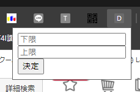
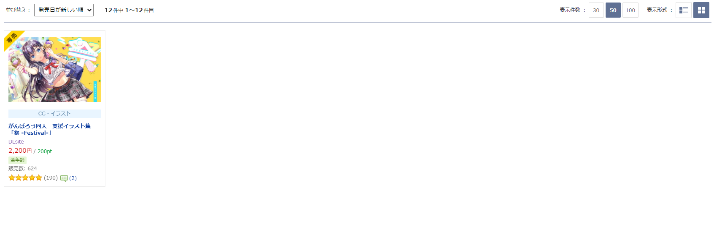

# DLsite sell supporter
セール来てるし漁りたいけど明らかに買う気が起こらない値段のやつまでまとめて漁るの面倒くさいなという悩みを解決するchrome拡張です。
作品、セールページにおいて、指定した範囲の価格の作品しか表示しないようになります。  

## 使用例
まず、このリポジトリをCloneしてChrome拡張として読み込んでください  
(やり方はこちら:[Chrome拡張の作り方 (超概要)](https://qiita.com/RyBB/items/32b2a7b879f21b3edefc#chrome%E3%81%B8%E3%81%AE%E9%81%A9%E7%94%A8%E6%96%B9%E6%B3%95))    

Chrome拡張として読み込むとブラウザ右上の拡張機能一覧に[D]と書かれたアイコンが表示されるのでクリックすると、このようなポップアップが出ます。  
  
上のフォームに表示したい価格の下限、下のフォームに上限を入力して決定を押すと、値が保存されます。

例えば上のフォームに0, 下のフォームに1000と入力して[DLsite](https://www.dlsite.com/home/works/discount)にアクセスしてみると、  
  
このように1000円以下の商品しか表示されないようになります。  
DLsiteをみている時にフォームから値を送り直した場合は、ページをリロードしてください。  
